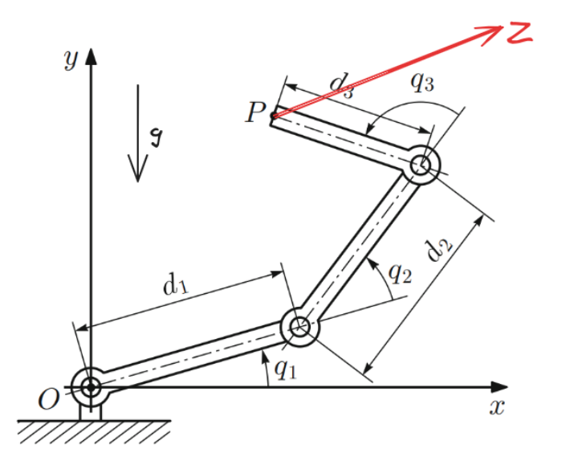

# 3R_control

For a given planar serial manipulator with 3 rotational joints (planar 3R), find a trajectory (angles, velocities, torques as a function of time) that moves its end-effector P from initial position to target point Z in given time T. The trajectory should minimize the integral of the sum of torque squares and take into account torque limits.

It is recommended to use Crocoddyl package and Python script to solve the problem. Robot parameters can be chosen arbitrarily and should be described in URDF file. Point coordinates, time and torque limits should be set as parameters in the code as any other required values.
Solution should be visualized. Code uploaded to Github.

